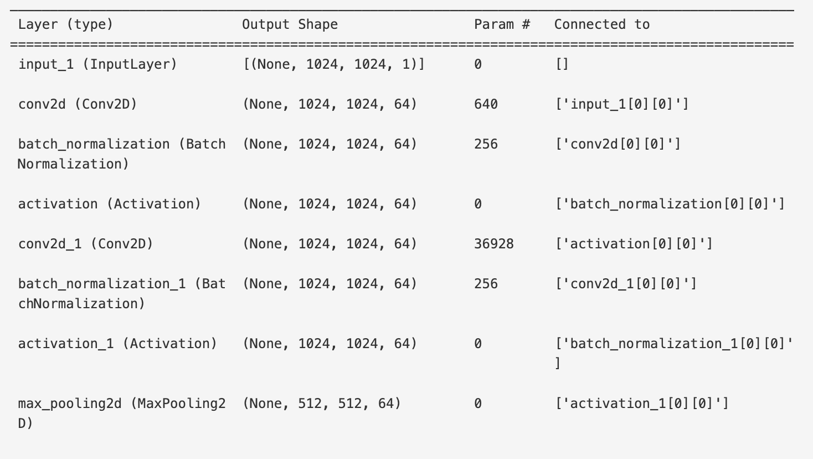
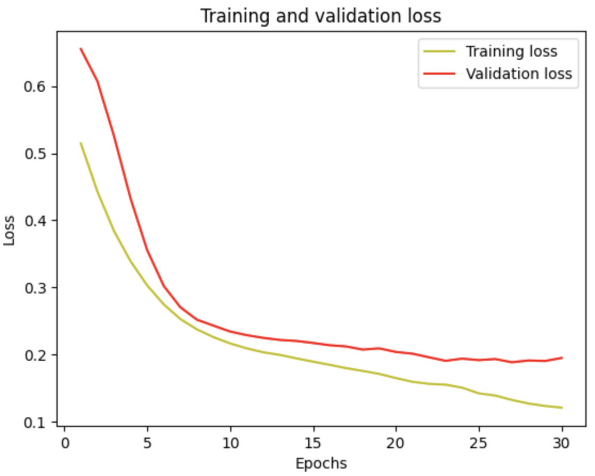
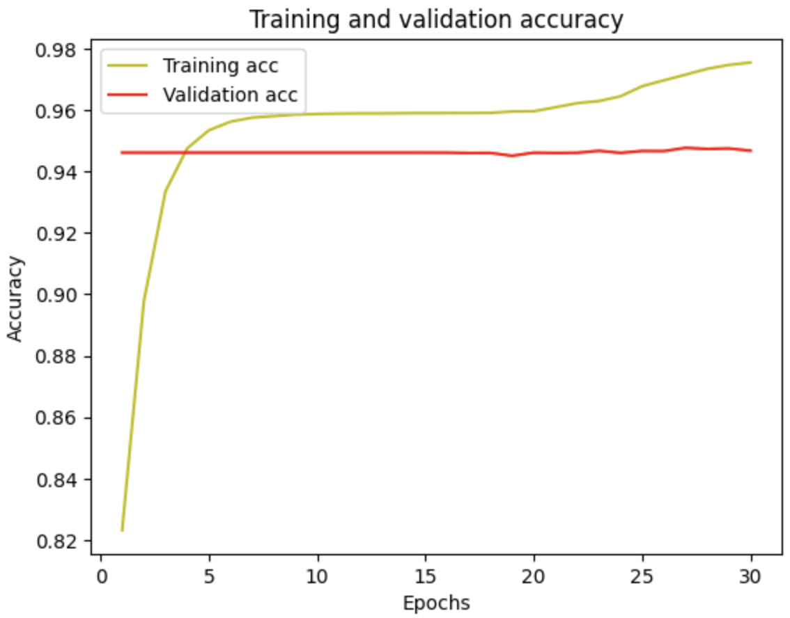
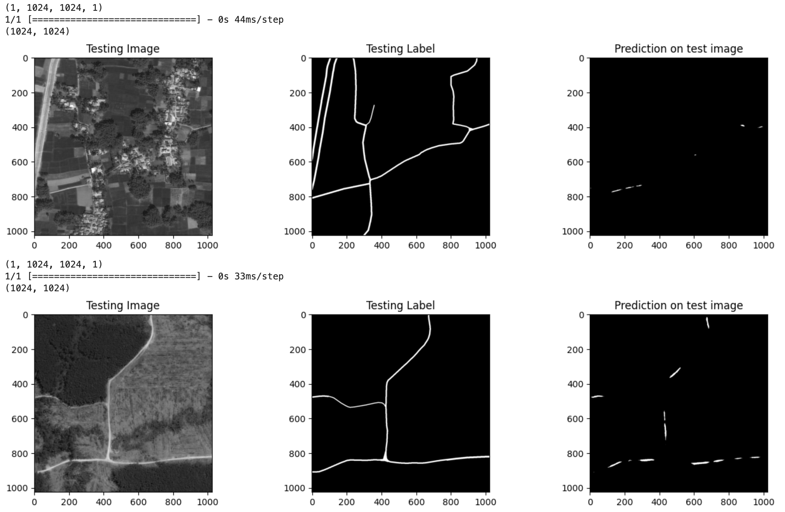

# Road Track(s) Identification Using Image Segmentation

## Overview
The project aims to create a low-latency reliable tool using computer vision technologies to aid with road track identification through image segmentation tasks. A model is developed based on the popular U-Net architecture to achieve this goal
DISCLAIMER!: This work is purely for educative purposes on the potential use of AI in this field/problem space. The currently developed model does not achieve class-leading results and thus any use of the said model is not recommended at this stage (Last Edit: March 6, 2024, 18:00 EAT)

## Dataset

The model development uses the [DeepGlobe Road Extraction Dataset](https://www.kaggle.com/datasets/balraj98/deepglobe-road-extraction-dataset).

- As of  March 6, 2024, 18:00 EAT, the dataset is available for download on the [Kaggle](https://www.kaggle.com) website under the username [balraj98](https://www.kaggle.com/balraj98).
- The original version of the data and documentation details can be found on this [page](https://competitions.codalab.org/competitions/18467)

## Model Architecture

## Evaluation Metrics

For evaluation, we use Mean IoU and achieve a score of: **0.48315087**, which is not that impressive, but improvement can be made.

*Mean Intersection over Union (Mean IoU) is the average of IoU scores calculated for multiple predictions in a dataset. It measures the overall accuracy of a segmentation model by considering the overlap between predicted and ground truth segmentation masks across all classes. A higher Mean IoU indicates better segmentation performance across different classes in the dataset.*

### *During Training*

- Loss >> *0.1953 after 30th epoch* 

---

- Accuracy >> - *0.9467 after 30th epoch*

## Results

Here are some sample results 

## Dependencies

#### Libraries
- kaggle
- opencv-python
- matplotlib
- pillow
- scikit-learn
- tensorflow[and-cuda]

#### Other
- libgl1: A in Linux systems that provides the OpenGL library, which is necessary for applications and libraries that use OpenGL for rendering graphics in 2D and 3D.
- Can be installed via _apt-get update_ && _apt-get install libgl1_

## License & Acknowledgments

MIT License

Acknowledgments
- Dataset: [Deepglobe](http://deepglobe.org/challenge.html)  and [Balraj Ashwath](https://www.kaggle.com/balraj98)

## Contact & Contributing

- [Send Email](mailto:oluoch9@gmail.com)
- For contributions, let us chat on email

